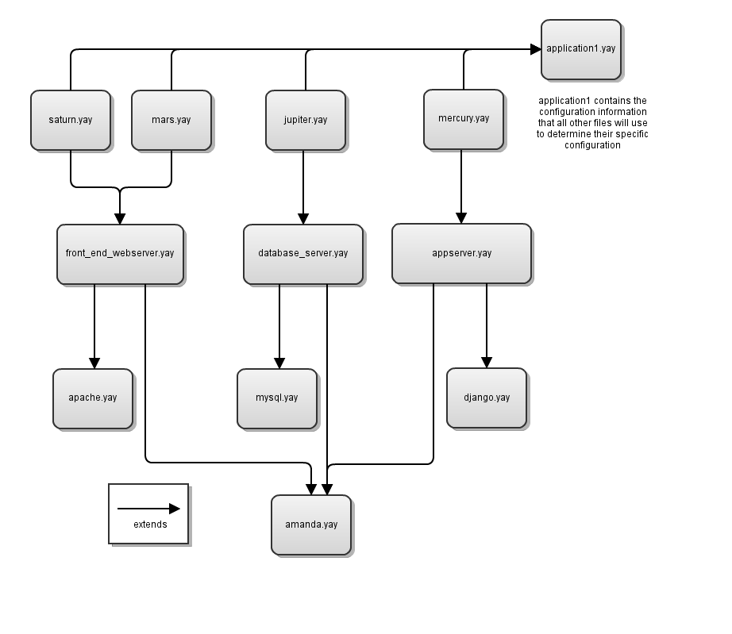

=======================
Getting into production
=======================

Yaybu is designed to manage the *configuration* of a system. This means things like:

 * the configuration of the base Operating System: networking, email, etc.
 * the software that is installed and the versions of that software
 * the configuration of the installed applications

It is not appropriate for conducting one-off or ad hoc system administration
tasks. If you want to copy a file or review log files, don't use Yaybu for
that.

When implementing Yaybu you should decide on the scope that is appropriate for
your needs.  We recommend of course managing as much of your configuration as
possible, to get the maximum benefits from the system.

Structuring your configurations
===============================

Your configurations need to be version controlled.  You will need to decide at
what level of granularity you want to do this: you might decide to have a
single collection of configuration for your entire infrastructure.  You might
decide to split internal and external infrastructure.  You might decide to
partition your configuration by system or customer or whatever: do what is
appropriate for your organisation.

Your configurations should be stored in source control always, which source
control system you use is up to you.  You should use the tools provided for
branching, tagging and merging to control release of your configurations.

The simplest way of structuring your configuration files is to provide a
hierarchy of configurations:

.. image:: yaybu-structure-1.png
   :alt: Simple extends structure

Each host has a configuration file. This includes configurations that specify
which software to install and configure on those hosts.

This means you can choose what software to deploy to which systems by simply
extending those configurations in your server specific files.

However, you will want to be able to configure this base software differently
depending on which overall application you are deploying on these hosts. If we
also extend an application configuration, this can provide the needed
metadata:

For example, application1.yay might contain::

    application:
        repository: http://svn.example.com/myapplication/tags/1.0
        primary-url: http://www.example.com/
        ports:
            web: 80
            appserver: 8080
            database: 3306
            proxy: 3128
        hosts:
            database: jupiter
            appserver: mercury

And then appserver.yay might look like::

    resources.append:
        - Checkout:
            name: /opt/app
            repository: ${application.repository}
            ...

        - File:
            name: /opt/app/config.py
            template: django_config.j2
            template_args:
                port: ${application.ports.appserver}
                ...

As you can see, we're able to apply application metadata anywhere we need to.
However, you must decide what the structure of your metadata is: this will
depend on your business and particularly your security and privacy concerns for
partitioning between infrastructures.

Building systems from bare metal
================================

.. toctree::
   :maxdepth: 1

   remote
